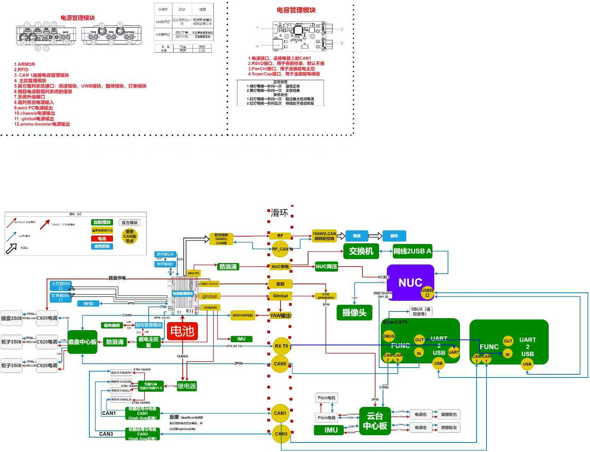
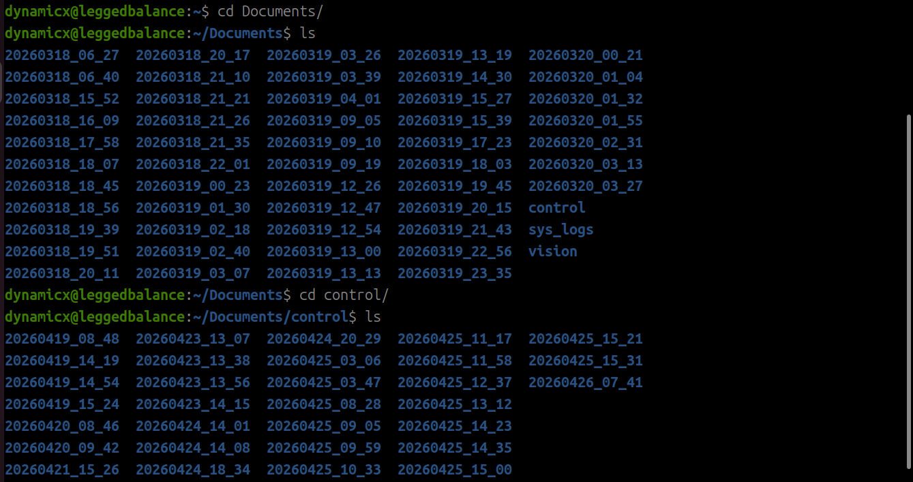
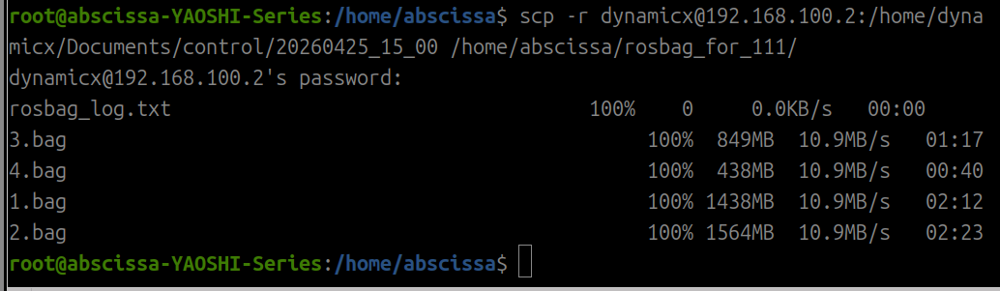

# message publish:

topic:/controllers/gimbal_controller/command
rate_pitch设参

# plotjuggler

## /controllers/gimble_controller/controllers

### pitch

/pid/state:速度环的pid相关监视参数
/pid_pos/state:位置环相关监视参数
/pos

# 电路拓扑图

# 拉rosbag

进入nuc终端后显示该图，时间戳是格林威治时间，需要+8小时换算北京时间
随后在终端下输入
scp -r dynamicx@192.168.100.2:/home/dynamicx/Documents/control/20260425_15_00 /home/abscissa/rosbag_for_111/
其中前者为用户+文件地址，后者为目标存放位置，中间有空格
